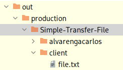

# Simple Transfer File
## Description
This is a very simple client and server application where the client send a file.txt to a server. It uses the Java Streams Api and Sockets to do it.

## Technologies
- Java

## Running
- Compile the project.
- Create a directory client in the compiled root directory.
- Create a file named `file.txt` in this directory. You can input some text in this file. For example, the [Copy Right](#copy-right) section has a link to one.
- At this point, you should have something like this:


- Start the server:
```bash
java alvarengacarlos.server.App
```

- Start the client:
```bash
java alvarengacarlos.client.App
```

- Check the server directory in the root of project.

## Copy Right
The text [Animals in the city](https://learnenglishteens.britishcouncil.org/study-break/reading-zone/b2-graded-reading/animals-city-b2) was created by Robin Newton and is hosted on British Council.

## References
https://docs.oracle.com/javase/tutorial/essential/io/index.html